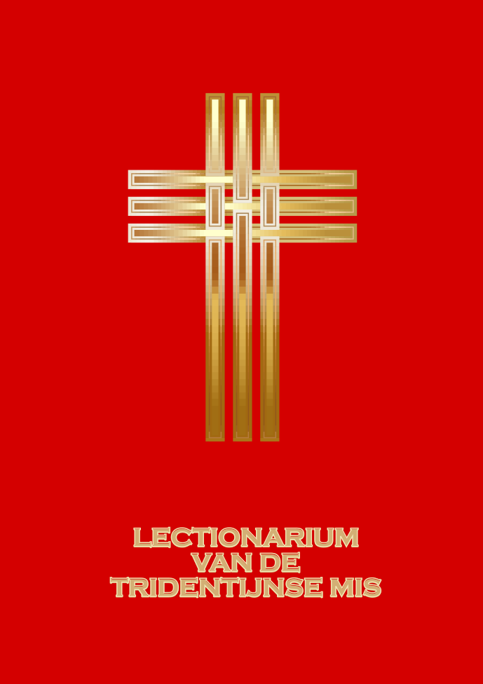

---
title:
---

De teksten in dit lectionarium komen overeen met de lezingen die worden voorgeschreven in het missaal van de Tridentijnse Mis, onder het pontificaat van paus Benedictus XVI ook gekend als de Buitengewone Vorm van de Latijnse Ritus. De Nederlandse vertalingen zijn genomen uit de Petrus Canisius bijbelvertaling, een vertaling uit de grondtekst in opdracht van de Apologetische Vereniging ‘Petrus Canisius’ ondernomen met goedkeuring van de hoogwaardige bisschoppen van Nederland (oorspronkelijke uitgave 1939). De integrale tekst van deze vertaling vindt men op [https://bijbel.gelovenleren.net](https://bijbel.gelovenleren.net). De afbeeldingen bij de evangelieteksten zijn genomen uit *Evangelicæ historiæ imagines: ex ordine evangeliorum, quæ toto anno in missæ sacrificio recitantur, in ordinem temporis vitæ Christi digestæ* (Jerónimo Nadal sj, Antwerpen, 1593).

Deze publicatie is ook beschikbaar als boek. Het formaat is 11,5 bij 16,7 cm dus ongeveer zoals een volksmissaal.

Zonder illustraties telt de publicatie 309 pagina's: 

Met illustraties telt de publicatie 463 pagina's:

Contact: <a href="mailto:info@gelovenleren.net">info@gelovenleren.net</a>
